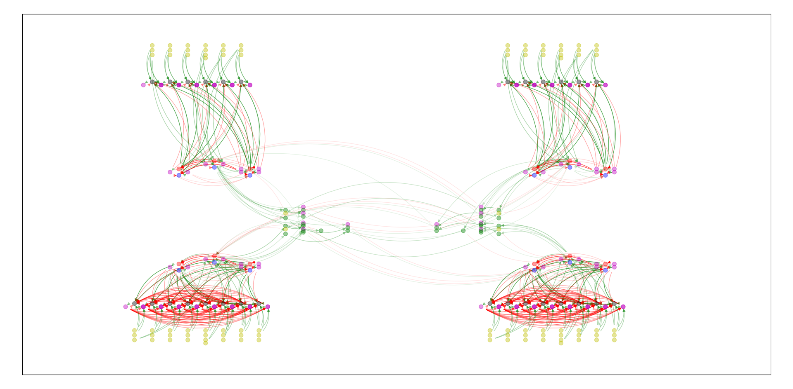

FARMS NETWORK
=============

AUTHORS: Jonathan Arreguit & Shravan Tata Ramalingasetty
--------------------------------------------------------

EMAIL: shravantr@gmail.com
--------------------------

Description :
-------------

This respository contains the necessary components to generate,
integrate, analyze and visualize neural network models. Currently the
following neuron models are implemented :

-  lif_danner
-  lif_danner_nap
-  lif_daun_interneuron
-  hh_daun_motorneuron
-  sensory_neuron
-  leaky_integrator
-  oscillator
-  morphed_oscillator
-  fitzhugh_nagumo
-  matsuoka_neuron
-  morris_lecar

Installation
============

Requirements
------------

-  Python 2/3
-  Cython
-  pip
-  tqdm
-  numpy
-  matplotlib
-  networkx
-  pydot
-  ddt
-  scipy
-  farms_pylog
-  farms_container

Steps for local install
-----------------------

The master branch is only supports Python 3. For Python 2 installation
jump XXXXX

For user installation
~~~~~~~~~~~~~~~~~~~~~

::

   pip install git+https://gitlab.com/farmsim/farms_network.git#egg=farms_network

For developer installation
~~~~~~~~~~~~~~~~~~~~~~~~~~

::

   git clone https://gitlab.com/farmsim/farms_network.git#egg=farms_network PATH_TO_THE_DIRECTORY
   cd PATH_TO_THE_DIRECTORY
   pip install -e . --user

For Python 2 user installation
~~~~~~~~~~~~~~~~~~~~~~~~~~~~~~

::

   pip install git+https://gitlab.com/farmsim/farms_network.git@python-2.7#egg=farms_network

For Python 2 developer installation
~~~~~~~~~~~~~~~~~~~~~~~~~~~~~~~~~~~

::

   git clone https://gitlab.com/farmsim/farms_network.git@python-2.7#egg=farms_network PATH_TO_THE_DIRECTORY
   cd PATH_TO_THE_DIRECTORY
   pip install -e . --user

Example
-------

   img

.. role:: raw-latex(raw)
   :format: latex
..

Implementation of neuron models in FARMS
========================================

#. | **Morris Lecar Model**
   | This is a two dimensional simplified version of the Hodgkin-Huxley
     neuron. It was first developed to reproduce the oscillatory
     behaviors in particular type of muscle fibers subject to change in
     ion channel conductance (:raw-latex:`\cite{morris_voltage_1981}`).
   | Here we consider a variation useful for nonlinear analysis given by
     :raw-latex:`\cite{liu_bifurcation_2014}`

     .. math:: \begin{aligned} C \frac{\mathrm{d} V}{\mathrm{d} t}=& I_{\text {stim }}-g_{\text {fast }} m_{\infty}(V)\left(V-E_{\mathrm{Na}}\right)-g_{\text {slow }} w\left(V-E_{\mathrm{k}}\right) \\ &-g_{\text {leak }}\left(V-E_{\text {leak }}\right) \\ \frac{\mathrm{d} w}{\mathrm{d} t} &=\phi_{w} \frac{w_{\infty}(V)-w}{\tau_{w}(V)} \end{aligned}

   :math:`V` is the fast activation variable and :math:`w` is the slow
   recovery variable. :math:`E` represents the equilibrium potential and
   :math:`g_{fast}`, :math:`g_{slow}` and :math:`g_{leak}` are the
   conductances of corrosponding fast, slow and leak currents
   respectively. The steady state activation functions are given by

   .. math:: \begin{aligned} m_{\infty}(V) &=0.5\left[1+\tanh \left(\frac{V-\beta_{m}}{\gamma_{m}}\right)\right] \\ w_{\infty}(V) &=0.5\left[1+\tanh \left(\frac{V-\beta_{w}}{\gamma_{w}}\right)\right] \\ \tau_{w}(V) &=\frac{1}{\cosh \left(\frac{V-\beta_{w}}{2 \gamma_{w}}\right)} \end{aligned}

   Since the system is two dimensional, phase plane analysis is easily
   tractable. Thus, it finds many applications in nonlinear analysis of
   neural dynamics for computational neuroscience
   (:raw-latex:`\cite{lecar_morris-lecar_2007}`).

#. | **Matsuoka Model**
   | This model was developed by
     :raw-latex:`\cite{matsuoka_sustained_1985}` to attempt modelling
     stable oscillatory behaviors that are observed in biological
     systems.

   The dynamics for two Matsuoka neurons with mutual inhibition is given
   by:

   .. math:: \begin{aligned} \tau \frac{\mathrm{d}}{\mathrm{d} t} V_{i}(t)+V_{i}(t) &=c-a y_{j}(t)-b w_{i}(t) \\(i, j=&1,2 ; j \neq i) \\ T \frac{\mathrm{d}}{\mathrm{d} t} w_{i}(t)+\nu_i w_{i}(t) &=y_{i}(t) \\ y_{i}(t)=g\left(V_{i}(t) - \theta_{i} \right) & \end{aligned}

   :math:`g(.)` is a piecewise linear function
   :math:`g(x)=\max \{0, x\}` which represents the threshold property of
   neurons. :math:`\nu_i` variable is used to capture the adaptive
   behavior observed in real neurons and plays a crucial role in
   generating stable limit cycles.

   It is observed that :math:`g` has a linear behavior in a limited
   sense, such that :math:`g(kx) = kg(x)` which simplifies the
   analytical treatment (covered in detail by
   :raw-latex:`\cite{matsuoka_analysis_2011}`). Since then, this model
   has been widely used to model central pattern generators
   (:raw-latex:`\cite{kimura_realization_1999}`,
   :raw-latex:`\cite{taga_self-organized_1991}`)

#. | **Fitzhugh Nagumo model**
   | This is a two dimensional simplified model of neurons modelled by
     :raw-latex:`\cite{fitzhugh_impulses_1961}` and
     :raw-latex:`\cite{nagumo_active_1962}`. It closely resembles to the
     Van der Pol oscillator with a forcing input. The dynamics are:

     .. math:: \begin{array}{l}{\dot{V}=V-\frac{V^{3}}{3}-w+I_{\mathrm{ext}}} \\ {\tau \dot{w}=V+a-b w}\end{array}

     As in Morris Lecar model, :math:`V` here is a fast activation
     variable and :math:`w` is a slow recovery variable. This model is
     used in the following section to study bifurcation analysis tools.
